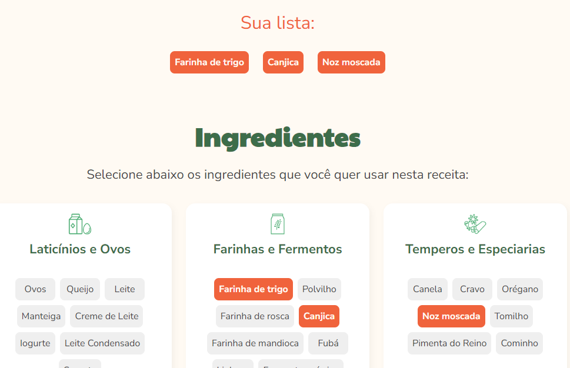
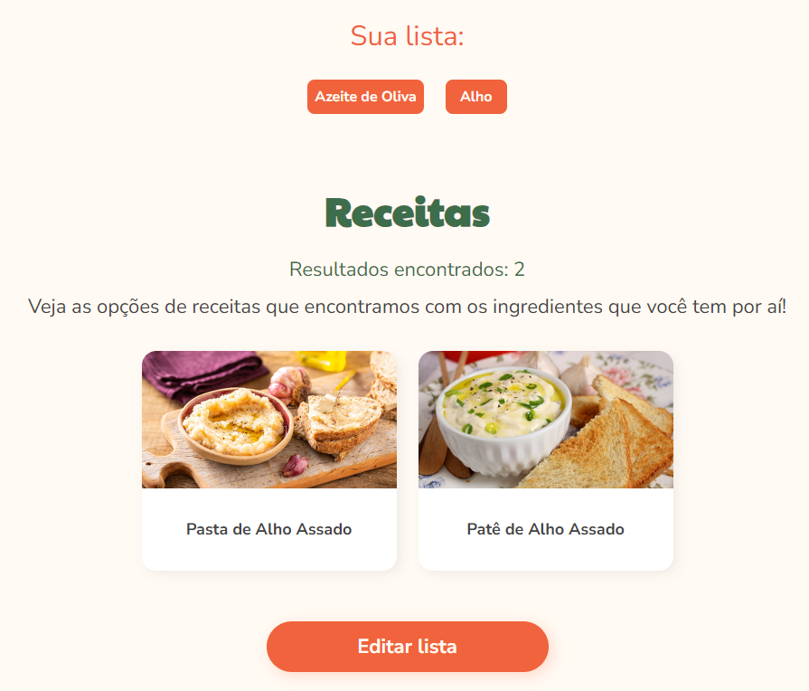

# Cookin up!

  <a href="#-tecnologias">Technologies</a>&nbsp;&nbsp;&nbsp;|&nbsp;&nbsp;&nbsp;
  <a href="#-projeto">Sobre o projeto</a>&nbsp;&nbsp;&nbsp;|&nbsp;&nbsp;&nbsp;
  <a href="#-usabilidade">Usabilidade</a>&nbsp;&nbsp;&nbsp;|&nbsp;&nbsp;&nbsp;

## 🚀 Tecnologias

Esse projeto foi desenvolvido com as seguintes tecnologias:

- JavaScript
- Vue JS 3

## 💻 Projeto

Este projeto foi desenvolvido para que possamos aprender a usar as diretivas do Vue, bem como a reutilização de componentes de forma estática e dinâmica, herdando propriedades e estados entre os mesmos. 

## Usabilidade

1. Basta que o usuário clique sobre os ingredientes dos Cards para formar uma combinação, e logo após, clicar em "buscar receitas":

2. Veja que a lista logo acima é preenchida automaticamente de acordo com os ingredientes selecionados.
3. Após clicar em buscar receitas, os resultados podem ou não ser obtidos.

Créditos: Alura
